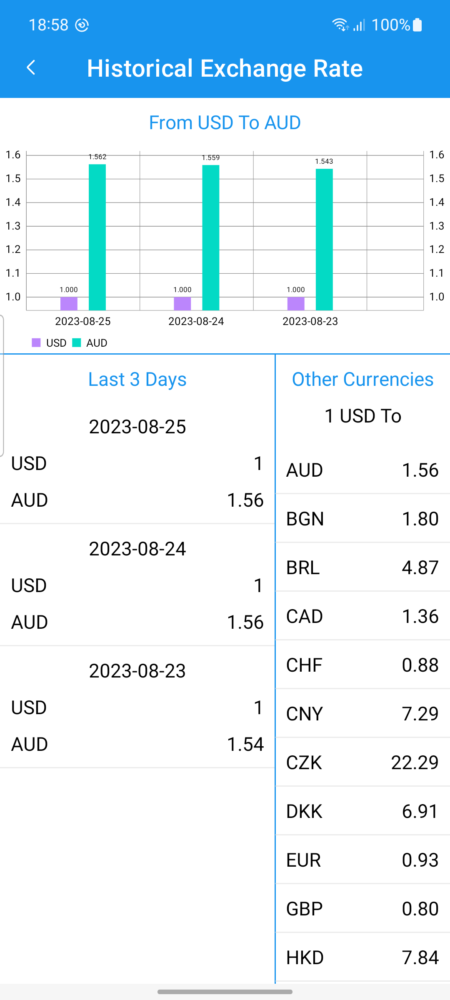

# CurrencyConverterApp
</h1>

<li> Currency app is designed to helps customers to hand different currency conversions.</li>
<li> home screen you can convert currencies from different bases.</li>
<li> In Details screen you will showing historical rates for last 3 days.</li>
<li> In Details screen you will showing historical rates chart for last 3 days.</li>
<li>  In Details screen you will showing other currencies values from selected currency.</li>

# ScreenShots:

  
  
  

  
# In-App architecture

# Tools & APIs
<ul>
  <li>Kotlin DSL</li>
  <li>Dependency Management</li>
  <li>MVVM Arch</li>
  <li>Clean architecture</li>
  <li>Dependency injection with dager Hilt</li>
  <li>freecurrencyapi.com</li>
  <li>Unit Testing</li>
  <li>UI Testing</li>
  <li>Retrofit</li>
  <li>OkHttp</li>
  <li>Kotlin Coroutines</li>
  <li>Navigation component</li>
  <li>View binding</li>
</ul>

 
